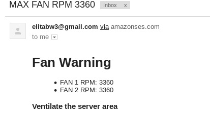

#Fanmail

An email to let you know when server fans are running above a certain RPM and thus making a ton of noise

Ensure a valid SES sending email address is specified

Emails will be sent if one fan is running above MAX_RPM

## Sample Email

## ~/.bashrc for standalone use

<!-- language: lang-none -->

    export SES_SENDER='sending_email@anothermailservice.com'
    export SES_DEST='dest_email@somemailservice.com'
    export MAX_RPM='2500'
    export AWS_ACCESS_KEY_ID=''
    export AWS_SECRET_ACCESS_KEY=''
    export AWS_DEFAULT_REGION=''

## systemD for use as a service

edit /etc/sysconfig/fanmail and add the ENV vars

<!-- language: lang-none -->

    SES_SENDER='sending_email@anothermailservice.com'
    SES_DEST='dest_email@somemailservice.com'
    MAX_RPM='2500'
    AWS_ACCESS_KEY_ID=''
    AWS_SECRET_ACCESS_KEY=''
    AWS_DEFAULT_REGION=''

## service

change paths in fanmail.service to match absolute location of this repo

ExecStart and WorkingDirectory

sudo cp fanmail.service /etc/systemd/system

sudo systemctl enable fanmail.service

sudo systemctl preset fanmail.service

## service operations

sudo service fanmail start|stop|restart|status

##AWS & python Requirements

apt install python3-pip

pip3 install awscli

you'll need to have a valid email account setup on AWS SES 

##Dell Requirements

###OpenManage

http://linux.dell.com/repo/community/ubuntu/

## omreport

$ omreport chassis fans

<!-- language: lang-none -->

    Fan Probes Information

    ----------------------------
    Main System Chassis Fans: Ok
    ----------------------------

    Index                     : 0
    Status                    : Ok
    Probe Name                : System Board FAN 3 RPM
    Reading                   : 2640 RPM
    Minimum Warning Threshold : [N/A]
    Maximum Warning Threshold : [N/A]
    Minimum Failure Threshold : 840 RPM
    Maximum Failure Threshold : [N/A]

    Index                     : 1
    Status                    : Ok
    Probe Name                : System Board FAN 4 RPM
    Reading                   : 2640 RPM
    Minimum Warning Threshold : [N/A]
    Maximum Warning Threshold : [N/A]
    Minimum Failure Threshold : 840 RPM
    Maximum Failure Threshold : [N/A]

